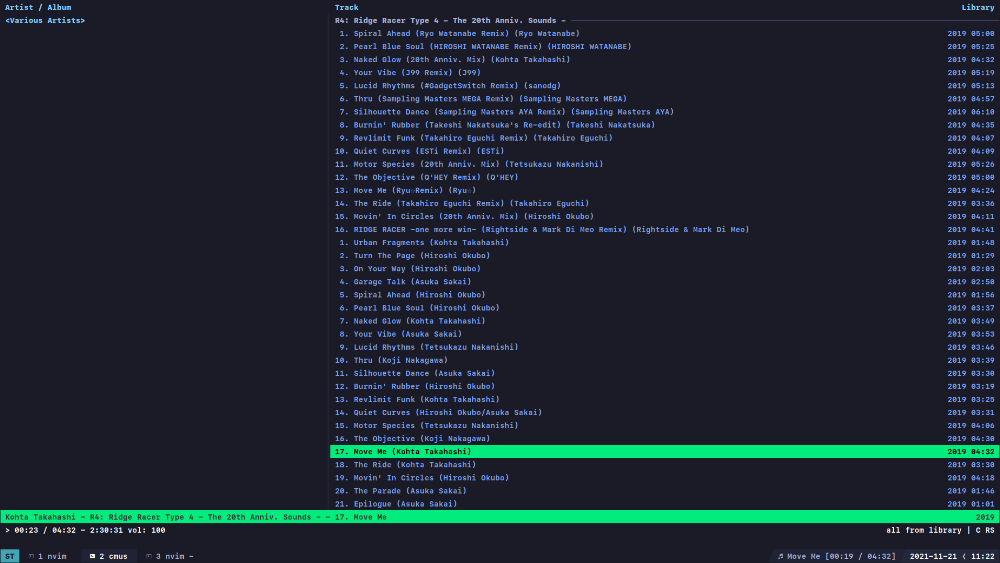

# Tokyo Night Tmux

A clean, dark Tmux theme that celebrates the lights of Downtown [Tokyo at night.](https://www.google.com/search?q=tokyo+night&newwindow=1&sxsrf=ACYBGNRiOGCstG_Xohb8CgG5UGwBRpMIQg:1571032079139&source=lnms&tbm=isch&sa=X&ved=0ahUKEwiayIfIhpvlAhUGmuAKHbfRDaIQ_AUIEigB&biw=1280&bih=666&dpr=2)

The perfect companion for [tokyonight-vim](https://github.com/ghifarit53/tokyonight-vim)

Adapted from the original, [Visual Studio Code theme](https://github.com/enkia/tokyo-night-vscode-theme).

The old version (deprecated) is still available in the `legacy` branch.

<a href="https://www.buymeacoffee.com/jano" target="_blank"></a>

### Installation using TPM

In your `tmux.conf`:
```
set -g @plugin "janoamaral/tokyo-night-tmux"
```

### Snapshots

##### New tokyonight

Terminal: ST
Fonts:
  - SF Mono
  - MesloLGLDZ Nerd Font Mono
  - Noto Sans Mono CJK JP
  - Symbola




Legacy tokyonight


