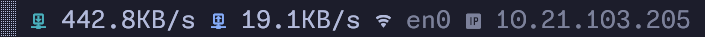
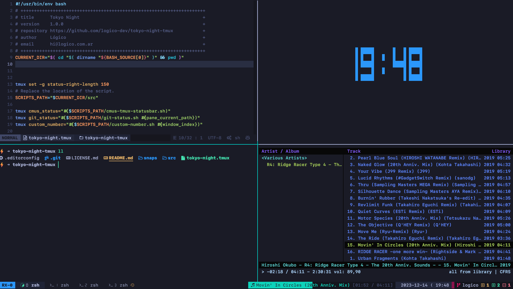

# Tokyo Night Tmux


A clean, dark Tmux theme that celebrates the lights of Downtown [Tokyo at night.](https://www.google.com/search?q=tokyo+night&newwindow=1&sxsrf=ACYBGNRiOGCstG_Xohb8CgG5UGwBRpMIQg:1571032079139&source=lnms&tbm=isch&sa=X&ved=0ahUKEwiayIfIhpvlAhUGmuAKHbfRDaIQ_AUIEigB&biw=1280&bih=666&dpr=2)
The perfect companion for [tokyonight-vim](https://github.com/ghifarit53/tokyonight-vim)
Adapted from the original, [Visual Studio Code theme](https://github.com/enkia/tokyo-night-vscode-theme).
The old version (deprecated) is still available in the `legacy` branch.

<a href="https://www.buymeacoffee.com/jano" target="_blank"></a>

## About this theme

This is a very opinionated project, as I am a Tech Lead, this theme is very developer-focused.

## Requirements

This theme has the following hard requirements:

- Any patched [Nerd Fonts] (v3 or higher)
- Bash 4.2 or newer

The following are recommended for full support of all widgets and features:

- [Noto Sans] Symbols 2 (for segmented digit numbers)
- [bc] (for netspeed and git widgets)
- [jq], [gh], [glab] (for git widgets)
- [playerctl] (Linux) or [nowplaying-cli] (macOS) for music statusbar

### macOS

macOS still ships with bash 3.2 so you must provide a newer version.
You can easily install all dependencies via [Homebrew]:

```bash
brew tap homebrew/cask-fonts
brew install --cask font-monaspace-nerd-font font-noto-sans-symbols-2
brew install bash bc coreutils gawk gh glab gsed jq nowplaying-cli
```

### Linux

#### Alpine Linux

```bash
apk add bash bc coreutils gawk git jq playerctl sed
```

#### Arch Linux

```bash
pacman -Sy bash bc coreutils git jq playerctl
```

#### Ubuntu

```bash
apt-get install bash bc coreutils gawk git jq playerctl
```

Check documentation for installing on other operating systems.

## Installation using TPM

In your `tmux.conf`:

```bash
set -g @plugin "janoamaral/tokyo-night-tmux"
```

## Configuration

### Number styles

Run these commands in your terminal:

```bash
tmux set @tokyo-night-tmux_window_id_style digital
tmux set @tokyo-night-tmux_pane_id_style hsquare
tmux set @tokyo-night-tmux_zoom_id_style dsquare
```

Alternatively, add these lines to your  `.tmux.conf`:

```bash
set -g @tokyo-night-tmux_window_id_style digital
set -g @tokyo-night-tmux_pane_id_style hsquare
set -g @tokyo-night-tmux_zoom_id_style dsquare
```

### Widgets

For widgets add following lines in you `.tmux.conf`

#### Date and Time widget

This widget is enabled by default. To disable it:

```bash
set -g @tokyo-night-tmux_show_datetime 0
set -g @tokyo-night-tmux_date_format MYD
set -g @tokyo-night-tmux_time_format 12H
```

##### Available Options

- `YMD`: (Year Month Day), 2024-01-31
- `MDY`: (Month Day Year), 01-31-2024
- `DMY`: (Day Month Year), 31-01-2024

- `24H`: 18:30
- `12H`: 6:30 PM

#### Now Playing widget

```bash
set -g @tokyo-night-tmux_show_music 1
```

#### Netspeed widget


```bash
set -g @tokyo-night-tmux_show_netspeed 1
set -g @tokyo-night-tmux_netspeed_iface "wlan0" # Detected via default route
set -g @tokyo-night-tmux_netspeed_showip 1      # Display IPv4 address (default 0)
set -g @tokyo-night-tmux_netspeed_refresh 1     # Update interval in seconds (default 1)
```

#### Path Widget

```bash
set -g @tokyo-night-tmux_show_path 1
set -g @tokyo-night-tmux_path_format relative # 'relative' or 'full'
```

#### Battery Widget

```bash
set -g @tokyo-night-tmux_show_battery_widget 1
set -g @tokyo-night-tmux_battery_name "BAT1"  # some linux distro have 'BAT0'
set -g @tokyo-night-tmux_battery_low_threshold 21 # default
```

Set variable value `0` to disable the widget. Remember to restart `tmux` after
changing values.

## Styles

- `none`: no style, default font
- `digital`: 7 segment number (🯰...🯹) (needs [Unicode support](https://github.com/janoamaral/tokyo-night-tmux/issues/36#issuecomment-1907072080))
- `roman`: roman numbers (󱂈...󱂐) (needs nerdfont)
- `fsquare`: filled square (󰎡...󰎼) (needs nerdfont)
- `hsquare`: hollow square (󰎣...󰎾) (needs nerdfont)
- `dsquare`: hollow double square (󰎡...󰎼) (needs nerdfont)
- `super`: superscript symbol (⁰...⁹)
- `sub`: subscript symbols (₀...₉)

### New tokyonight Highlights ⚡

Everything works out the box now. No need to modify anything and colors are hardcoded,
so it's independent of terminal theme.

- Local git stats.
- Web based git server (GitHub/GitLab) stats.
  - Open PR count
  - Open PR reviews count
  - Issue count
- Remote branch sync indicator (you will never forget to push or pull again 🤪).
- Great terminal icons.
- Prefix highlight incorporated.
- Now Playing status bar, supporting [playerctl]/[nowplaying-cli]
- Windows has custom pane number indicator.
- Pane zoom mode indicator.
- Date and time.

#### TODO

- Add configurations
  - remote fetch time
  - ~number styles~
  - indicators order
  - disable indicators

### Demo

https://github.com/janoamaral/tokyo-night-tmux/assets/10008708/59ecd814-bc2b-47f2-82b1-ffdbfbc54fbf

### Snapshots

- Terminal: Kitty with [Tokyo Night Kitty Theme](https://github.com/davidmathers/tokyo-night-kitty-theme)
- Font: [SFMono Nerd Font Ligaturized](https://github.com/shaunsingh/SFMono-Nerd-Font-Ligaturized)



Legacy tokyo-night


## Contributing

> [!IMPORTANT]  
> Please read the [contribution guide first](CONTRIBUTING.md).

Feel free to open an issue or pull request with any suggestions or improvements.

Ensure your editor follows the style guide provided by `.editorconfig`.
[pre-commit] hooks are also provided to ensure code consistency, and will be
run against any raised PRs.

[pre-commit]: https://pre-commit.com/
[Noto Sans]: https://fonts.google.com/noto/specimen/Noto+Sans
[Nerd Fonts]: https://www.nerdfonts.com/
[coreutils]: https://www.gnu.org/software/coreutils/
[bc]: https://www.gnu.org/software/bc/
[jq]: https://jqlang.github.io/jq/
[playerctl]: https://github.com/altdesktop/playerctl
[nowplaying-cli]: https://github.com/kirtan-shah/nowplaying-cli
[Homebrew]: https://brew.sh/
