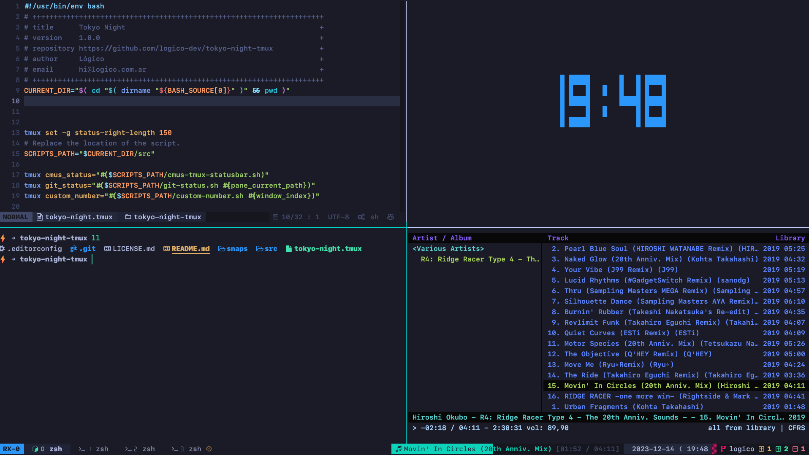
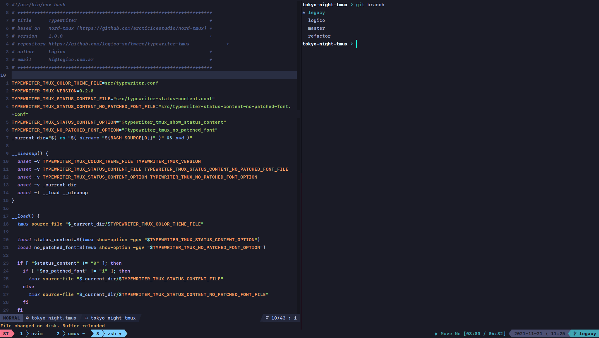

# Themes

[← Back to README](../README.md) · [Installation →](installation.md) · [Widgets →](widgets.md) · [Customization →](customization.md)

---

## Available themes

Tokyo Night Tmux comes with four color variants, all based on the original [Tokyo Night VS Code theme](https://github.com/enkia/tokyo-night-vscode-theme).

| Name | Background | Description |
|---|---|---|
| `night` | `#1A1B26` | Default. Deep dark blue-black. |
| `storm` | `#24283b` | Slightly lighter dark blue. |
| `moon` | `#222436` | Muted blue-purple. |
| `day` | `#d5d6db` | Light theme. |

### Previews

**Night (default)**



**Legacy preview**



---

## Configuring the theme

Add to your `~/.tmux.conf`:

```bash
set -g @tokyo-night-tmux_theme night   # night | storm | moon | day
```

Restart tmux or reload your config for changes to take effect:

```bash
tmux source ~/.tmux.conf
```

---

## Transparent background

Remove the solid background color so the theme inherits your terminal's background:

```bash
set -g @tokyo-night-tmux_transparent 1   # 1 = transparent | 0 = solid (default)
```

This sets the tmux background color to `default`, so your terminal background shows through.

---

## Next steps

- [Enable widgets](widgets.md)
- [Customize number and window styles](customization.md)
