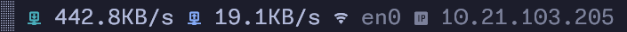

# Widgets

[← Back to README](../README.md) · [Installation →](installation.md) · [Themes →](themes.md) · [Customization →](customization.md)

---

Widgets appear in the tmux status bar. All widgets are **disabled by default** unless noted otherwise. Set a widget's option to `0` to disable it; restart tmux after changing values.

---

## Date & Time

> Enabled by default.

Displays current date and time in the status bar.

```bash
set -g @tokyo-night-tmux_show_datetime 1   # 1 = enabled (default) | 0 = disabled
set -g @tokyo-night-tmux_date_format YMD   # see options below
set -g @tokyo-night-tmux_time_format 24H   # see options below
```

### Date format options

| Value | Format | Example |
|---|---|---|
| `YMD` | Year-Month-Day | `2024-01-31` |
| `MDY` | Month-Day-Year | `01-31-2024` |
| `DMY` | Day-Month-Year | `31-01-2024` |
| `hide` | Hidden | *(not shown)* |

### Time format options

| Value | Format | Example |
|---|---|---|
| `24H` | 24-hour | `18:30` |
| `12H` | 12-hour with AM/PM | `6:30 PM` |
| `hide` | Hidden | *(not shown)* |

---

## Now Playing

Shows the currently playing track from your media player.

```bash
set -g @tokyo-night-tmux_show_music 1
```

**Requirements:**
- **Linux:** [playerctl](https://github.com/altdesktop/playerctl)
- **macOS:** [nowplaying-cli](https://github.com/kirtan-shah/nowplaying-cli)

Supports any MPRIS-compatible player on Linux (Spotify, VLC, Firefox, etc.) and the macOS system media controls.

---

## Netspeed



Displays real-time upload and download speeds for a network interface.

```bash
set -g @tokyo-night-tmux_show_netspeed 1
set -g @tokyo-night-tmux_netspeed_iface "wlan0"  # auto-detected via default route if omitted
set -g @tokyo-night-tmux_netspeed_showip 1       # show IPv4 address (default: 0)
set -g @tokyo-night-tmux_netspeed_refresh 1      # update interval in seconds (default: 1)
```

**Requirements:** [bc](https://www.gnu.org/software/bc/)

The interface is auto-detected from the default route if `@tokyo-night-tmux_netspeed_iface` is not set.

---

## Path

Shows the current pane's working directory in the status bar.

```bash
set -g @tokyo-night-tmux_show_path 1
set -g @tokyo-night-tmux_path_format relative   # 'relative' or 'full'
```

| Value | Description | Example |
|---|---|---|
| `relative` | Home directory replaced with `~` | `~/dev/myproject` |
| `full` | Absolute path | `/home/user/dev/myproject` |

---

## Battery

Displays battery level with a contextual icon that changes based on charge state (discharging, charging, full, plugged in).

```bash
set -g @tokyo-night-tmux_show_battery_widget 1
set -g @tokyo-night-tmux_battery_name "BAT1"      # default: 'BAT1' (Linux), 'InternalBattery-0' (macOS)
set -g @tokyo-night-tmux_battery_low_threshold 21  # show warning below this % (default: 21)
```

**Supported platforms:** Linux, macOS, Windows (Cygwin/WSL).

> On Linux, some distributions use `BAT0` instead of `BAT1`. Check with `ls /sys/class/power_supply/`.

---

## Local Git Status

Shows git information for the repository in the current pane, including branch name, file changes, and remote sync state.

```bash
set -g @tokyo-night-tmux_show_git 1
```

**Requirements:** [bc](https://www.gnu.org/software/bc/)

### What it shows

| Indicator | Meaning |
|---|---|
| Branch name | Current branch (truncated to 25 chars) |
| `󱓎` (dim red) | Uncommitted local changes |
| `󰛃` (red) | Local commits not yet pushed |
| `󰛀` (magenta) | Remote is ahead — pull needed |
| `` (green) | Branch is clean and in sync |
| ` N` (yellow) | N changed files |
| ` N` (green) | N inserted lines |
| ` N` (red) | N deleted lines |
| ` N` (dim) | N untracked files |

---

## Web-based Git Widget

Shows GitHub or GitLab repository statistics directly from the remote server: open PRs, pending reviews, and assigned issues.

```bash
set -g @tokyo-night-tmux_show_wbg 1
```

**Requirements:**
- GitHub: [gh CLI](https://cli.github.com/) — must be authenticated (`gh auth login`)
- GitLab: [glab CLI](https://gitlab.com/gitlab-org/cli) — must be authenticated (`glab auth login`)

### What it shows

| Indicator | Meaning |
|---|---|
| ` N` (green) | N open pull/merge requests |
| ` N` (yellow) | N PRs awaiting your review |
| ` N` (green) | N open issues assigned to you |
| ` N` (red) | N open bug issues assigned to you |

Works with both SSH (`git@github.com:user/repo.git`) and HTTPS (`https://github.com/user/repo.git`) remotes.

> **Note:** The widget throttles API calls — if `status-interval` is under 20 seconds, requests are spaced out to avoid hitting rate limits.

---

## Hostname

Displays the machine hostname in the left side of the status bar (next to the session name).

```bash
set -g @tokyo-night-tmux_show_hostname 1
```

Hostname is detected via `hostnamectl` (Linux), `scutil` (macOS), or the `hostname` command as a fallback.

---

## Next steps

- [Customize number and window styles](customization.md)
- [Change the color theme](themes.md)
